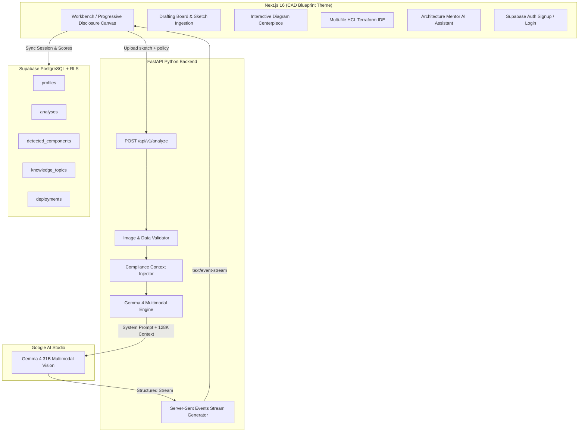

# ☁️ Cloud Buddy — AI-Powered Cloud Architecture Tutor

> **Upload a hand-drawn cloud architecture sketch → Get real-time AI architectural critique, interactive CAD diagrams, HCL Terraform code, and policy compliance validation** — powered by **Gemma 4 Multimodal** & **Supabase**.

[](https://ai.google.dev)
[](https://fastapi.tiangolo.com)
[](https://nextjs.org)
[](https://supabase.com)
[](LICENSE)

---

## 🌟 Executive Summary

**Cloud Buddy** is a flagship AI Cloud Architecture Studio. Designed for cloud architects, DevOps engineers, and students, Cloud Buddy bridges the gap between rough whiteboard sketches and production-grade cloud deployments. 

Simply upload a whiteboard drawing or CAD diagram: Cloud Buddy utilizes **Google Gemma 4 Multimodal** to analyze your architecture, identify single points of failure, compute security & cost health scores, render interactive diagrams, and stream production-ready **HCL Terraform code**.

---

## 🏗️ System Architecture



---

## ✨ Key Features

| Feature | Description |
|---------|-------------|
| 🎨 **Multimodal Vision Analysis** | Upload whiteboard sketches or digital diagrams — Gemma 4 identifies EC2, S3, RDS, VPCs, Load Balancers, IAM roles, and gateways. |
| ⚡ **SSE Real-Time Streaming** | Server-Sent Events deliver AI reasoning, component detection, and code generation progressively as the AI thinks. |
| 📐 **Progressive Disclosure UI** | Stage-guided engineering workspace ("Apple meets Figma for Cloud Architects") featuring single-focal-point transitions and 8px grid alignment. |
| 💻 **HCL Terraform IDE** | Multi-file code editor (`main.tf`, `variables.tf`, `outputs.tf`, `providers.tf`) with line numbers, syntax highlighting, copy, and `.tf` download bundle. |
| 🛡️ **Compliance Context Engine** | Upload SOC2, HIPAA, PCI-DSS, or ISO 27001 policy PDFs/TXTs — Gemma enforces rules as hard constraints in Terraform. |
| 🗄️ **Supabase Integration** | PostgreSQL database with Row Level Security (RLS) policies and authentication flow for saved analyses and deployment state. |
| ⚡ **Global Search & Command Palette** | Instant `Ctrl + K` / `Cmd + K` search modal for fast command execution. |
| 🤖 **Architecture Mentor AI** | Context-aware AI chat assistant powered by Gemma 4 to answer node-specific security & cost questions. |
| 🚀 **Deployment & Validation Engine** | Canary deployment visual diff, OPA/Checkov policy validation, and automated IAM conflict checks (`/deploy`). |
| 📚 **Architectural Knowledge Hub** | Reference tutorials, comparison tables (NACLs vs SGs), and Terraform code patterns (`/knowledge`). |

---

## 🎨 Design Language (Blueprint Theme)

Cloud Buddy uses a custom engineering blueprint design system inspired by Apple, Figma, and mechanical CAD drafting tables:

- **Deep Navy Background**: `#081B36`
- **Solid Navy Panels**: `#0B2545`
- **Blueprint Grid Lines**: `#1D4E7A`
- **Construction Orange Marker**: `#E8871E`
- **Paper White Text**: `#F2EFE6`
- **Muted Steel Blue**: `#AFC2D4`
- **Typography**: `Space Grotesk` (headings), `Inter` (interface), `JetBrains Mono` (HCL code & telemetry).

---

## 📁 Project Structure

```text
cloud-buddy/
├── backend/                              # FastAPI Python Backend
│   ├── app/
│   │   ├── main.py                       # FastAPI entrypoint, CORS, SSE /api/v1/analyze
│   │   ├── config.py                     # Pydantic settings & environment vars
│   │   ├── schemas/
│   │   │   └── analysis.py               # Structured output models (Pydantic v2)
│   │   └── services/
│   │       ├── gemma_service.py          # Gemma 4 SDK vision/text wrapper
│   │       └── supabase_service.py       # Supabase Python client helper
│   ├── requirements.txt                  # Python dependencies (fastapi, supabase, google-genai)
│   ├── Dockerfile                        # Backend Docker container config
│   └── .env.example                      # Backend env template
│
├── frontend/                             # Next.js 16 Turbopack Frontend
│   ├── app/
│   │   ├── layout.tsx                    # Root layout & font configuration
│   │   ├── page.tsx                      # Landing page (marketing & features)
│   │   ├── workbench/page.tsx            # Progressive Disclosure Workbench (CAD Workspace)
│   │   ├── deploy/page.tsx               # Deployment Strategy & Validation page
│   │   ├── knowledge/page.tsx            # Architectural Knowledge Hub
│   │   ├── signup/page.tsx               # Supabase Authentication signup flow
│   │   ├── icon.svg & favicon.ico        # Branding favicons & app icons
│   │   └── globals.css                   # Blueprint CAD design system & CSS tokens
│   ├── components/
│   │   ├── Navbar.tsx                    # Header with project breadcrumbs, provider switcher & search
│   │   ├── WorkspaceSidebar.tsx          # Collapsible left navigation rail
│   │   ├── DraftingBoard.tsx             # Interactive sketch ingestion & sample presets
│   │   ├── DiagramCanvas.tsx             # Interactive Mermaid/CAD diagram centerpiece
│   │   ├── CritiqueViewer.tsx            # Structured risk finding cards
│   │   ├── CodeExporter.tsx              # HCL Terraform multi-file IDE
│   │   ├── AIReasoningPanel.tsx          # Live telemetry feed & health score progress bars
│   │   ├── ArchitectureMentorChat.tsx    # Context-aware Gemma 4 AI assistant drawer
│   │   ├── CommandPalette.tsx            # Ctrl + K command search modal
│   │   ├── SessionHistoryDrawer.tsx      # Past analysis sessions timeline drawer
│   │   ├── CloudBuddyLogo.tsx            # Friendly cloud mascot SVG component
│   │   └── ProviderSelector.tsx          # AWS / GCP / Azure segmented selector
│   ├── lib/
│   │   └── supabaseClient.ts             # Supabase Browser Client instance
│   └── hooks/
│       └── useCloudCanvasStream.ts       # Custom SSE streaming consumer hook
│
├── scripts/
│   └── seed_demo_data.py                 # Demo sketch generator script
│
├── dev.bat                               # Windows 1-click launch script
├── dev.sh                                # macOS / Linux 1-click launch script
├── docker-compose.yml                    # Full-stack Docker orchestration
└── README.md                             # Documentation (You are here)
```

---

## 🚀 Quick Start & Installation

### Prerequisites

- **Python 3.11+**
- **Node.js 18+** with `npm`
- **Google AI Studio API Key** ([Get your API key](https://aistudio.google.com/apikey))
- **Supabase Project** (URL & Anon Key)

---

### 1. Environment Configuration

Create configuration files in both `backend` and `frontend`:

#### Backend (`backend/.env`):
```env
GOOGLE_API_KEY=your_google_ai_studio_key
GEMMA_MODEL=gemma-4-31b-it
SUPABASE_URL=https://your-supabase-project.supabase.co
SUPABASE_KEY=your-supabase-anon-key
MAX_UPLOAD_SIZE_MB=10
CORS_ORIGINS=["http://localhost:3000"]
DEBUG=false
```

#### Frontend (`frontend/.env.local`):
```env
NEXT_PUBLIC_SUPABASE_URL=https://your-supabase-project.supabase.co
NEXT_PUBLIC_SUPABASE_ANON_KEY=your-supabase-anon-key
NEXT_PUBLIC_API_URL=http://localhost:8000
```

---

### 2. Launch Local Development (1-Click)

#### Windows:
```cmd
dev.bat
```

#### macOS / Linux:
```bash
chmod +x dev.sh
./dev.sh
```

#### Docker Compose (Alternative):
```bash
docker compose up --build
```

---

### 3. Access Application

- **Frontend Workbench:** [http://localhost:3000/workbench](http://localhost:3000/workbench)
- **FastAPI API Documentation:** [http://localhost:8000/docs](http://localhost:8000/docs)

---

## 🔌 API Reference

### `POST /api/v1/analyze`

Accepts an architecture sketch image and streams SSE events progressively.

**Content-Type:** `multipart/form-data`

| Parameter | Type | Required | Description |
|-----------|------|----------|-------------|
| `image_file` | File | ✅ | PNG, JPEG, or WebP architecture sketch |
| `compliance_doc` | File | ❌ | PDF or TXT security compliance policy |
| `cloud_provider` | String | ❌ | Target cloud: `AWS`, `GCP`, or `Azure` (default: `AWS`) |

**Stream Event Sequence (`text/event-stream`):**

```text
event: metadata
data: {"cloud_provider": "AWS", "model": "gemma-4-31b-it", "status": "processing"}

event: critique
data: {"detected_components": [...], "critique": {"score": 84, "summary": "...", "findings": [...]}}

event: mermaid
data: {"mermaid_code": "graph TD\n  ALB --> EC2\n  EC2 --> RDS"}

event: terraform
data: {"terraform_code": "resource \"aws_vpc\" \"main\" {\n  cidr_block = \"10.0.0.0/16\"\n}"}

event: done
data: {"status": "complete"}
```

---

## 📄 License

Distributed under the **MIT License**. See [`LICENSE`](LICENSE) for details.

---

<p align="center">
  Crafted with ⚡ by the <strong>Cloud Buddy</strong> Team<br/>
  Powered by <strong>Google Gemma 4 Multimodal Engine</strong>
</p>
