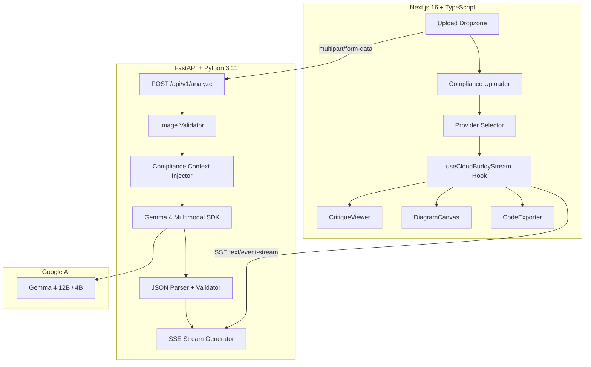

# ☁️ CloudBuddy — AI-Powered System Design Tutor

> **Upload a hand-drawn cloud architecture sketch → Get an instant architectural critique, interactive Mermaid diagram, and production-ready Terraform code** — powered by Gemma 4 Multimodal.

[](https://python.org)
[](https://nextjs.org)
[](https://ai.google.dev)
[](LICENSE)

---

## 🏗️ Architecture Overview



---

## ✨ Key Features

| Feature | Description |
|---------|-------------|
| 🎨 **Visual Analysis** | Upload whiteboard sketches — Gemma 4 identifies EC2, S3, RDS, VPCs, Load Balancers, and more |
| 🔍 **Architecture Critique** | Detailed findings with severity levels: single points of failure, security gaps, cost issues |
| 📊 **Interactive Diagrams** | Live Mermaid.js rendering with zoom, pan, fullscreen, and PNG export |
| 💻 **Terraform Generation** | Production-ready, fully commented `.tf` code with syntax highlighting |
| 🛡️ **Compliance Enforcement** | Upload SOC2/HIPAA/PCI-DSS policies — Gemma enforces them as hard constraints |
| ⚡ **Real-time Streaming** | Server-Sent Events deliver results progressively as they're generated |
| 🌙 **Glassmorphic Dark UI** | Premium developer IDE aesthetic with Framer Motion animations |

---

## 📁 Project Structure

```
cloud-buddy/
├── backend/                          # FastAPI Python backend
│   ├── app/
│   │   ├── main.py                   # FastAPI app, CORS, /api/v1/analyze
│   │   ├── config.py                 # Pydantic Settings (env vars)
│   │   ├── schemas/
│   │   │   └── analysis.py           # Pydantic models for structured output
│   │   └── services/
│   │       └── gemma_service.py      # Gemma 4 SDK wrapper + compliance injection
│   ├── requirements.txt
│   ├── Dockerfile
│   └── .env.example
│
├── frontend/                         # Next.js 16 TypeScript frontend
│   ├── app/
│   │   ├── layout.tsx                # Root layout, fonts, metadata
│   │   ├── page.tsx                  # Main workbench (state + layout)
│   │   └── globals.css               # Dark-mode design system
│   ├── components/
│   │   ├── Navbar.tsx                # Glassmorphic header + status indicator
│   │   ├── UploadDropzone.tsx        # Drag-and-drop image upload
│   │   ├── ComplianceUploader.tsx    # PDF/TXT compliance uploader
│   │   ├── ProviderSelector.tsx      # AWS / GCP / Azure pill buttons
│   │   ├── CritiqueViewer.tsx        # Streaming Markdown renderer
│   │   ├── DiagramCanvas.tsx         # Interactive Mermaid.js canvas
│   │   └── CodeExporter.tsx          # Syntax-highlighted Terraform viewer
│   └── hooks/
│       └── useCloudBuddyStream.ts   # SSE streaming consumer hook
│
├── scripts/
│   └── seed_demo_data.py             # Generate mock sketches + compliance docs
│
├── docker-compose.yml                # One-command full-stack dev setup
├── dev.bat                           # Windows dev launcher
├── dev.sh                            # macOS/Linux dev launcher
└── README.md                         # ← You are here
```

---

## 🚀 Quick Start

### Prerequisites

- **Python 3.11+** with pip
- **Node.js 18+** with npm
- **Google AI Studio API Key** ([Get one here](https://aistudio.google.com/apikey))

### 1. Clone & Configure

```bash
git clone <your-repo-url>
cd cloud-buddy

# Configure the backend
cp backend/.env.example backend/.env
# Edit backend/.env and set your GOOGLE_API_KEY
```

### 2. Run (Pick One Method)

#### Option A: Dev Script (Recommended for Local)

**Windows:**
```cmd
dev.bat
```

**macOS / Linux:**
```bash
chmod +x dev.sh
./dev.sh
```

#### Option B: Docker Compose

```bash
docker compose up --build
```

#### Option C: Manual

```bash
# Terminal 1 – Backend
cd backend
pip install -r requirements.txt
uvicorn app.main:app --host 0.0.0.0 --port 8000 --reload

# Terminal 2 – Frontend
cd frontend
npm install
npm run dev
```

### 3. Open the App

- **Frontend:** [http://localhost:3000](http://localhost:3000)
- **API Docs:** [http://localhost:8000/docs](http://localhost:8000/docs)

---

## 🧪 Demo Data

Generate mock architecture sketches and a SOC2 compliance document:

```bash
cd scripts
pip install pillow   # If not already installed
python seed_demo_data.py
```

This creates `scripts/demo_data/` with:
- `architecture_sketch_basic.png` — 3-tier AWS architecture
- `architecture_sketch_microservices.png` — ECS microservices
- `architecture_sketch_serverless.png` — Serverless event-driven
- `SOC2_Compliance_Rules.txt` — Enterprise security policy

Upload any sketch to CloudBuddy, attach the compliance doc, and hit **Analyze**!

---

## ⚙️ Configuration

All backend configuration is via environment variables (or `backend/.env`):

| Variable | Required | Default | Description |
|----------|----------|---------|-------------|
| `GOOGLE_API_KEY` | ✅ | — | Google AI Studio API key |
| `GEMMA_MODEL` | ❌ | `gemma-4-12b-it` | Model variant (`gemma-4-12b-it` or `gemma-4-4b-it`) |
| `DEFAULT_CLOUD_PROVIDER` | ❌ | `AWS` | Default provider (AWS, GCP, Azure) |
| `MAX_UPLOAD_SIZE_MB` | ❌ | `10` | Max file upload size |
| `CORS_ORIGINS` | ❌ | `["http://localhost:3000", "http://localhost:5173"]` | Allowed CORS origins |
| `DEBUG` | ❌ | `false` | Enable debug logging |

---

## 🔌 API Reference

### `POST /api/v1/analyze`

**Content-Type:** `multipart/form-data`

| Field | Type | Required | Description |
|-------|------|----------|-------------|
| `image_file` | File | ✅ | JPEG/PNG/WebP architecture sketch |
| `compliance_doc` | File | ❌ | PDF/TXT compliance policy |
| `cloud_provider` | String | ❌ | `AWS`, `GCP`, or `Azure` (default: `AWS`) |

**Response:** `text/event-stream` (SSE)

| Event | Payload |
|-------|---------|
| `metadata` | `{ cloud_provider, model, status, compliance_loaded }` |
| `critique` | `{ detected_components[], critique { summary, findings[], score } }` |
| `mermaid` | `{ mermaid_code }` |
| `terraform` | `{ terraform_code }` |
| `done` | `{ status: "complete", compliance_enforced }` |
| `error` | `{ error, detail }` |

### `GET /health`

Returns `{ "status": "healthy" }` for liveness probes.

---

## 🛡️ Compliance Context Engine

CloudBuddy supports **enterprise compliance enforcement** via its context injection layer:

1. **Upload** a security policy document (PDF/TXT) alongside your sketch
2. The full document is **injected into Gemma 4's system prompt** — not truncated to a user message
3. Gemma treats every policy rule as an **immutable constraint**:
   - Violations are flagged as `CRITICAL` findings
   - Terraform code automatically includes mandatory controls
   - Architecture score is heavily penalised for non-compliance
4. Supported frameworks: SOC2, HIPAA, PCI-DSS, FedRAMP, ISO 27001, NIST

---

## 🏆 Hackathon Presentation Points

### The Problem
- System design interviews and architecture reviews require expertise
- Hand-drawn whiteboard sketches are never digitised or validated
- Compliance validation is manual, error-prone, and expensive

### Our Solution: CloudBuddy
- **One-click analysis** of whiteboard sketches using Gemma 4 Multimodal
- **Real-time streaming** results via SSE for instant feedback
- **Enterprise compliance enforcement** — upload your SOC2/HIPAA policy and get guaranteed compliance
- **Production-ready output** — Terraform code you can actually deploy

### Technical Differentiators
- 🧠 **Gemma 4 Multimodal** — visual understanding + code generation in one model
- 📜 **128K context window** — entire compliance documents, not just summaries
- ⚡ **SSE streaming** — progressive rendering as the AI thinks
- 🎨 **Glassmorphic UI** — premium developer experience
- 🏗️ **Full IaC generation** — not just diagrams, but deployable Terraform

### Impact
- **10× faster** architecture reviews
- **Zero compliance misses** with policy-as-context
- **Bridge the gap** between whiteboard and production

---

## 🛠️ Tech Stack

| Layer | Technology |
|-------|-----------|
| **AI Model** | Gemma 4 Multimodal (12B / 4B) via Google GenAI SDK |
| **Backend** | Python 3.11, FastAPI, Pydantic v2, uvicorn |
| **Frontend** | Next.js 16, TypeScript, Tailwind CSS |
| **UI Components** | Framer Motion, Lucide Icons |
| **Rendering** | Mermaid.js, react-markdown, react-syntax-highlighter |
| **Transport** | Server-Sent Events (SSE) |
| **Containerization** | Docker, Docker Compose |

---

## 📄 License

MIT License — see [LICENSE](LICENSE) for details.

---

<p align="center">
  Built with ⚡ by the CloudBuddy team<br/>
  Powered by <strong>Gemma 4 Multimodal</strong>
</p>
